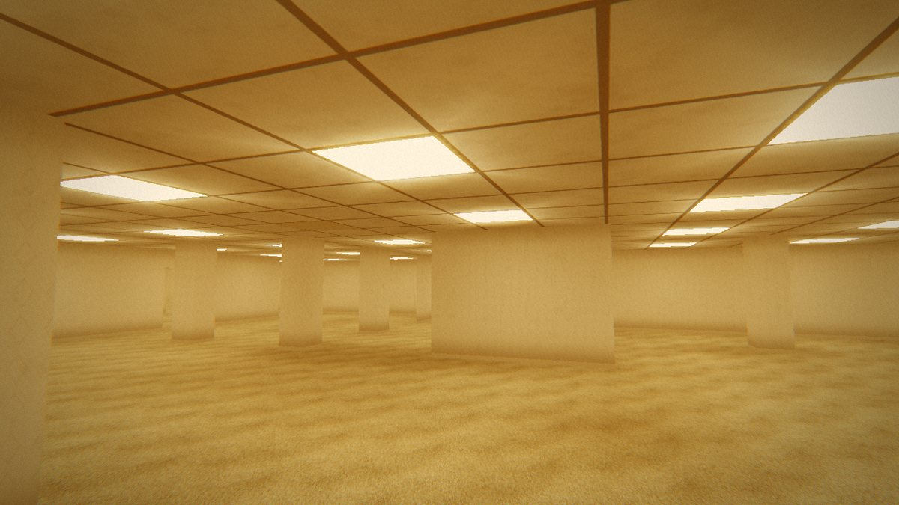

# Level 0 (The Backrooms)

A first-person walk through an endless Backrooms Level 0: moist carpet,
mono-yellow wallpaper, square fluorescent panels humming overhead, rooms and
pillared halls that never end. Walk with the keyboard and look around with the
mouse, or with your head through the webcam.



## Run it

Static files, no build step. Three.js and MediaPipe load from jsDelivr.
Camera access needs `https://` or `localhost`:

```sh
cd sites/backrooms
python3 -m http.server 8000
# open http://localhost:8000
```

On GitHub Pages it is published at
<https://ashokaitoolss-cell.github.io/t-m/backrooms/> (see
`.github/workflows/pages.yml`).

## Controls

| | |
| --- | --- |
| <kbd>W</kbd> <kbd>A</kbd> <kbd>S</kbd> <kbd>D</kbd> / <kbd>↑</kbd> <kbd>↓</kbd> | walk |
| <kbd>Shift</kbd> | run |
| mouse | look (click the view to capture the mouse) |
| <kbd>←</kbd> <kbd>→</kbd> | turn |
| <kbd>C</kbd> | recenter your head (camera mode) |
| <kbd>M</kbd> / <kbd>V</kbd> / <kbd>F</kbd> | sound / REC overlay / fullscreen |
| <kbd>Esc</kbd> | menu: sensitivity, head look strength, volume, blur, lens, overlay |
| touch | drag on the left half to walk, on the right half to look |

**Looking with your head:** turn your head and the view turns further
(2.2× by default). Hold it turned past about 14° and you keep turning that
way, so you can go all the way round without leaving the screen. Lean to
peek round corners. If the camera loses you, the view eases back to straight
ahead. The mouse and keyboard still work alongside it.

## How it feels

Movement and camera follow the reference footage it was built from:

- You start lying on the carpet and get up.
- The view eases after the mouse instead of snapping to it. It banks into
  turns and drifts a little like a hand-held camera.
- Walking adds a bob and sway, at 1.55 m/s (3.3 m/s running), with a little
  inertia.
- Fast turns smear with motion blur.
- Wide 92° lens, an over-bright warm grade, bloom on the lights.

## How it works

| File | |
| --- | --- |
| `js/world.js` | The floor plan, a pure function of the seed. Walls run in broken lines along a 3.6 m grid (long walls with gaps, doorways, tight mazes in some regions, open pillared halls in others). Also collision boxes and a spawn search that never starts you in a sealed pocket |
| `js/chunks.js` | Streams 8×8-cell chunks within ~100 m: merged wall geometry, floor and ceiling with a baked occlusion map, light panels |
| `js/shaders.js` | Wallpaper, carpet, ceiling and panel shaders, plus the camcorder pass |
| `js/player.js` | Movement, collisions, and the camera behaviour above |
| `js/input.js` | Keyboard, pointer-lock mouse, touch sticks |
| `js/head-tracker.js` | MediaPipe Face Landmarker: head position, plus yaw and pitch from its pose matrix |
| `js/audio.js` | Synthesised hum, ballast buzz, room tone, footsteps |
| `js/main.js` | Wiring, menus, head look mapping |

**Lighting.** Every cell has a panel in the middle of its ceiling. Each
fragment adds up light from the nine nearest panels as downward-facing area
lights. There are no light objects at all, so the light is the same however
far you walk. Whether a panel is on, dead or flickering comes from an integer
hash that is bit-identical in JavaScript and GLSL. The panels you see, the
light they throw and the buzz you hear therefore always agree.

**The look.** Surfaces are nearly neutral and the yellow comes from the
grade. It is a per-channel curve, roughly (r^0.45, g^0.8, b^1.8) after a soft
tone map. I fitted it to colours measured in the reference footage: walls
come out ochre, the ceiling a deep orange-brown, and the panels stay white.

## Assets and credits

- Carpet (Carpet011), ceiling tiles (OfficeCeiling001) and wall stains
  (Wallpaper002B) are from [ambientCG](https://ambientcg.com), CC0. The
  wallpaper pattern, baseboards and outlets are drawn in the shader.
- [three.js](https://threejs.org) r186 for rendering;
  [MediaPipe Face Landmarker](https://ai.google.dev/edge/mediapipe/solutions/vision/face_landmarker)
  for head tracking.
- The Backrooms began as a 2019 creepypasta. This is a fan-made interpretation
  of its Level 0.
