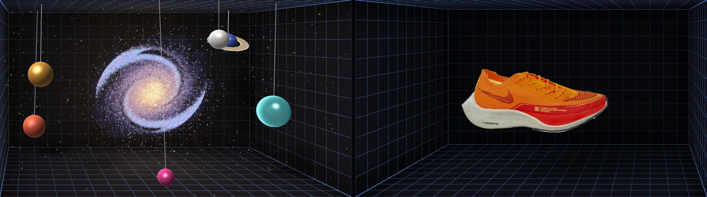

# Splat Window

Your screen becomes a window onto a 3D Gaussian Splatting scene. The webcam
tracks your head (MediaPipe, entirely in the browser) and the scene is drawn
with an off-axis "window" projection, so when you move, it shifts the way a
real scene behind glass would. Some of it even sits in front of the glass. No
camera, or rather not? The mouse (or a finger) stands in for your head.



## Run it

Plain static files with no build step and no dependencies to install.
Browsers only allow camera access on `https://` or `localhost`:

```sh
cd sites/splat-window
python3 -m http.server 8000
# open http://localhost:8000
```

Any static host works. Needs a browser with WebGL2: current Chrome, Edge,
Firefox or Safari, desktop or mobile.

### GitHub Pages

`.github/workflows/pages.yml` publishes `sites/` (this folder ends up at
<https://ashokaitoolss-cell.github.io/t-m/splat-window/>) whenever a push to
the default branch changes it, or when run by hand from the Actions tab. Once,
beforehand: **Settings → Pages → Build and deployment → Source: GitHub Actions**.

## Using it

- **Use my camera** turns on face tracking. Sit roughly in front of the middle
  of the screen and press **Recenter** (<kbd>C</kbd>) once. If the face is lost
  the view holds still for a moment, then falls back to the mouse.
- **Use the mouse**: the pointer is your head. Point right to look in from the
  right, scroll (or pinch) to lean in and out. Left alone, the view drifts
  slowly so the depth still reads.
- **Scenes**: *Orrery* is generated in the browser. *Sneaker*, *Plush* and
  *Train* are real captures streamed from Hugging Face (9–33 MB).
  **Open…** or drag and drop your own `.ply` (standard 3DGS output) or `.splat`.
- **Settings**: parallax strength, the room grid, and the camera preview.
- Keys: <kbd>1</kbd>–<kbd>4</kbd> scenes, <kbd>C</kbd> recenter,
  <kbd>G</kbd> room, <kbd>F</kbd> fullscreen, <kbd>H</kbd> hide controls,
  <kbd>O</kbd> open a file.

The effect is strongest in fullscreen, with one eye closed (the image is
right for one viewpoint, so your two eyes disagree a little), or filmed with a
phone held next to your head.

### URL parameters

| Parameter | |
| --- | --- |
| `?scene=sneaker` | Start on a scene: `orrery`, `sneaker`, `plush`, `train` |
| `?url=…splat` | Load a remote `.ply` / `.splat` (the host must allow CORS) |
| `&rot=180,0,0&size=0.32&pos=0,0,-0.5` | Place it: Euler degrees, size in screen heights, centre position |
| `&crop=3&maxScale=0.02&spin=0.2&room=0` | Drop far-away or huge splats, turntable speed, hide the box |
| `?debug` | Frame rate, splat count and eye position overlay |
| `?capture&eye=x,y,z&t=3` | Fixed eye and time, renders a few frames then stops (for screenshots) |

## How it works

**Window units.** The page is 1 unit tall with the origin at its centre, and
z points out of the screen towards you. The scene lives at z < 0, "behind the
glass", inside a box the size of the page.

**Off-axis projection** (`js/math.js`). Like Johnny Lee's 2007 Wii-remote head
tracking demo: the camera sits at the eye and always looks straight into the
screen; only the frustum shears so its edges pass through the edges of the
page. Because the view never rotates, depth order is just world z, so the
worker only re-sorts when something in the scene moves, never because your
head did.

**Splat renderer** (`js/renderer.js`). WebGL2 port of the 3D Gaussian Splatting
rasteriser: every splat's 3D covariance is projected to a screen-space ellipse
(EWA), drawn as an instanced quad and composited front to back. Splats are
packed into an `RGBA32UI` texture (position, colour, half-float covariance,
animation group). A second, full-screen pass ray-casts the box behind the
glass into whatever the splats left uncovered, with anti-aliased grid lines,
corner shading and soft shadows.

**Worker** (`js/splat-worker.js`). Parses files, finds a robust centre and size
for captures, applies each scene's placement, packs the texture and keeps
re-sorting splats by depth with a 16-bit counting sort.

**Head tracking** (`js/head-tracker.js`, `js/viewer.js`). MediaPipe Face
Landmarker finds 478 face landmarks per frame. The eye corners give the point
between the eyes; how far apart they appear gives the distance (assuming
62 mm between eye centres and a 60° webcam). A One Euro filter steadies it. The
webcam is assumed to sit centred above the screen, which window geometry
pins down relative to the page; **Recenter** stores a correction. The
library (~11 MB) only downloads once you turn the camera on.

**Fallback chain** (`js/main.js`): face → hold the last position for 1.5 s
when the face is lost → mouse / touch → slow idle drift.

### Files

| File | |
| --- | --- |
| `index.html`, `style.css` | Page, controls, intro card |
| `js/main.js` | Wires everything together: scenes, sorting, input, render loop, UI |
| `js/renderer.js` | WebGL2 splat and room shaders |
| `js/splat-worker.js` | Parsing, placement, texture packing, depth sorting |
| `js/formats.js` | `.splat` and `.ply` readers |
| `js/orrery.js` | The procedural scene and its animation |
| `js/scenes.js` | Scene list and placement presets |
| `js/head-tracker.js` | Webcam + MediaPipe head position |
| `js/pointer-input.js` | Mouse / touch fallback |
| `js/viewer.js` | Screen geometry estimates, head → eye conversion |
| `js/math.js` | Matrices and the window projection |

## Limits

- Colour is the view-independent (DC) term only; spherical harmonics in `.ply`
  files are ignored. Compressed formats (`.spz`, compressed `.ply`) don't load.
- Browsers don't report the screen's physical size, so it's estimated
  (a CSS pixel ≈ 0.24 mm, 0.165 mm on phones). If the depth feels too strong
  or too weak, use **Parallax strength**.

## Credits

- Sample captures from [antimatter15/splat](https://github.com/antimatter15/splat),
  hosted at [cakewalk/splat-data](https://huggingface.co/cakewalk/splat-data).
  The train is from the Tanks and Temples dataset.
- Face tracking: [MediaPipe Face Landmarker](https://ai.google.dev/edge/mediapipe/solutions/vision/face_landmarker) (Apache 2.0).
- Rendering follows Kerbl et al., *3D Gaussian Splatting for Real-Time Radiance
  Field Rendering* (SIGGRAPH 2023), and antimatter15's WebGL viewer.
