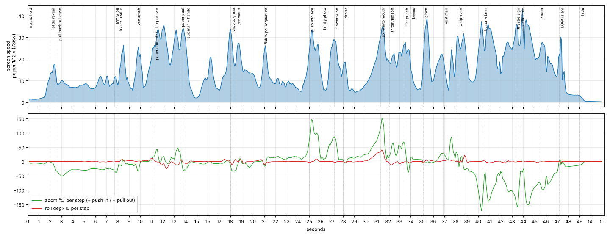
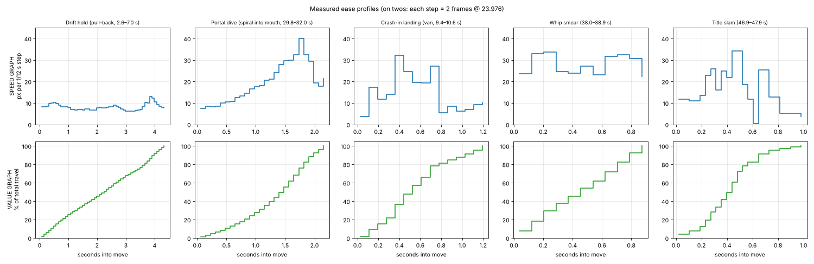
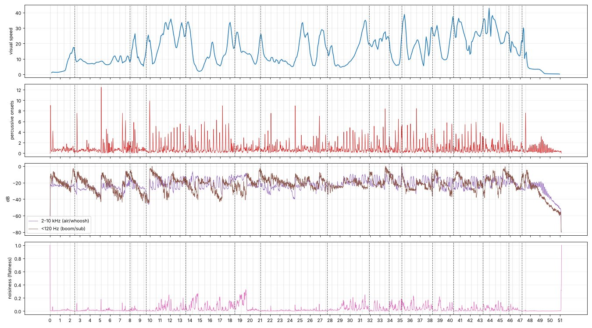
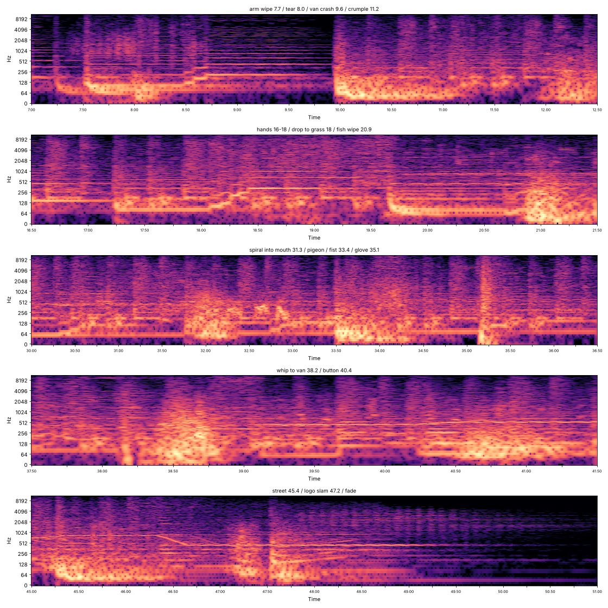

# Collage Diorama: style document

A reusable style for narrated or titled shorts, studied from the opening titles of Netflix's
*The WONDERfools* (원더풀스, 2026, 51 s). It blends that look with the story engine of the
*vox-motion-graphics* skill and the Higgsfield **Katana** remix pipeline.

We copy the **style**, not the content: no scenes, characters, names, logo or music from the
reference. Every number below was measured from the 736×414 copy we were given, using the scripts
in `tools/` (see [How this was measured](#how-this-was-measured)). Sound was measured from
spectrograms, not listened to. Statements marked *authored* are our rules for the new work rather
than observations.

**Pictures and video.** This file marks where each visual reference belongs (30 figures and 20
clips, plus the full reference). Because they are frames from the reference and this repo is public,
they are not committed.
`tools/build_pack.py` renders them from the reference video into an illustrated PDF, HTML page and
zip under `refs/pack/`. To brief another AI, give it that PDF, or the zip if it accepts video.

> **The look in one line.** A lit tabletop world of real props and paper sets, where photo cut-out
> people act like stiff paper puppets. One continuous camera travels through it, diving through
> eyes, mouths and tears into the next world. The whole thing is animated on twos and scored so the
> music hits the action.

<!-- ref:overview-contact -->

<!-- ref:style-board -->

---

## 1. Non-negotiables

If a frame breaks one of these, it is not this style.

1. **On twos.** 12 new images per second in a 24 fps file (every image held for 2 frames), camera
   moves included. Only the final title slam runs on ones.
2. **No visible hard cuts.** Every scene change is an in-camera transition: an occluder wipe, a
   tear, a portal or a smear. The piece reads as one take.
3. **People are paper.** Real photographs of people, cut out and printed on matte paper, standing in
   a 3D world. They move like puppets: rigid parts, hinged jaws, limbs that swing. Faces get swapped
   for objects as gags (onion, flowers, a document, glasses).
4. **The world is physical and lit.** Real-looking props and materials (brushed metal, brick,
   plush, leather, beans, globes, paper maps), soft warm key light, shallow miniature depth of
   field.
5. **A new world about every 2.6 s**, and a camera speed peak about every 1.75 s. The camera never
   stops dead between peaks.
6. **Scale whiplash.** Macro, then wide, then giant: a giant eye with a tiny man, a fist that fills
   the frame, a bear the size of a church.
7. **Text lives on torn-paper tags** placed in 3D space. Nothing else in frame carries lettering
   except the title card.
8. **Warm print grade.** Warm shadows, cream highlights that never clip, a muted base with a few
   saturated accents, and a natural vignette.
9. **The score hits the action**: booms on landings, whooshes on wipes, a rising whistle on reveals
   and a falling glide into the title. It is not edited to a beat grid.

---

## 2. Format and framing

| Property | Reference (measured) | Our default (*authored*) |
| --- | --- | --- |
| Container | 736×414, 23.976 fps, H.264 + AAC 44.1 kHz stereo | 24 fps |
| Active picture | **736×370 = 1.99:1 letterbox** (22 px bars top and bottom) | 16:9 delivery: 2:1 letterbox. 9:16 delivery: full bleed (see below) |
| Unique images | 12 per second (on twos) for 0–47.0 s; on ones for the 0.5 s title slam | Same |
| Length | 51.05 s: 47 s of journey, 2 s title hold, 2 s fade to black | Set by the concept |

<!-- ref:format-letterbox -->

**Vertical (9:16) adaptation** (*authored*, since the reference is 2:1):
- Keep the hero inside the central 60% band.
- Use the top and bottom thirds as the zones where occluders enter and tags sit. Occluders come in
  vertically (a hand from the top, a fish from below) more often than sideways.
- Keep the stage idea: frontal and centred.

### Composition rules (observed)

- **Proscenium staging.** Most worlds are seen frontally at eye level, hero centred, like a stage
  or shop window. Top-down (11.9–13.5 s) and worm's-eye shots are rare accents.
- **Four depth planes in nearly every frame:**
  1. Out-of-focus foreground props cropped by the frame edge (globes, hands, flowers, fish).
  2. The hero cut-out.
  3. The set: suitcase, facade, car, bean wall.
  4. A backdrop: bedroom, paper sky, aquarium, black.
- **Hero size.** Mid-shots fill about 35–50% of frame height. "Tiny man" shots shrink the hero to
  about 10% under a giant object.
- **Tags** sit in a corner away from the hero, rotated 5–15°, usually on the side the camera is
  moving away from.

<!-- ref:comp-proscenium -->

<!-- ref:comp-depth-planes -->

<!-- ref:comp-tags -->

### Visual hierarchy (what the eye hits, in order)

1. The hero's face, or the object replacing it (onion, sunflowers, document).
2. The single most saturated accent near the hero (red piggy bank, orange koi, yellow vest).
3. The tag.
4. Foreground occluders, which are soft and partial so they frame rather than compete.
5. Textured background.

Only one thing is loud at a time.

<!-- ref:comp-hierarchy -->

---

## 3. Art direction: building a world

| Layer | What it is | How it moves |
| --- | --- | --- |
| Backdrop | Physical surfaces: brick facade, wood floor, papered wall, torn blue paper sea, paper sky, black void | Static. Parallax comes only from the camera |
| Set piece | A container the scene lives in: open suitcase, cinema facade, car interior, bean wall, cassette | Static, or one big action (crash, crumple) |
| Props | Photoreal objects at odd scale: Rubik's cube, piggy bank, Game Boy, globes, football, umbrella, chair, slippers | Float, drift on slow arcs, fly in and out |
| Hero cut-outs | Real photos printed as paper standees, with visible paper edges and a soft contact shadow | Puppet motion: jaw flap, arm swing, mid-air sitting pose, sliding as a whole piece |
| Crowd cut-outs | Repeated hands and arms, crowds from behind | Enter staggered (offset and delay), wave, clap |
| Occluders | Arms, hands, fists, fish, birds, flower panels, gloves | Cross the lens fast. They are the transitions |
| Tags | Torn-edge paper labels in orange, red, mustard, olive or cobalt, with white sans-serif text | Swing in, overshoot slightly, then sway (follow-through) |

<!-- ref:art-layers -->

**Gags that define the tone.** Each one replaces a face or object with an unexpected thing, held
for about 1–2 s:
- Onion for a head
- Sunflower eyes, or a flower over the whole face
- A document over half the face
- Cut-out eyes on a cassette tape
- A crumpled SUV that folds into a paper ball

Use one per world, never two at once.

<!-- ref:art-gags -->

**Era props.** The reference is set in 1999: Game Boy, cassette, Y2K banner, 90s van. For a new
concept, pick one coherent era or theme and draw the prop vocabulary from it (*authored*).

<!-- ref:art-era -->

---

## 4. Texture and grade

Measured on the active picture, one frame every 0.5 s, 0–47 s:

| Property | Value | Meaning |
| --- | --- | --- |
| Mean colour | a\* +6.2, b\* +12.6 | Clearly warm (amber), slightly red |
| Shadow tint | a\* +5.6, b\* +6.9 | Brown-warm shadows, not teal |
| Highlight tint | a\* +0.3, b\* +5.2 | Cream highlights |
| White point | L\* 87 (per-frame max, median) | Highlights roll off and never clip to white, like a print |
| Black point | L\* 0 (5th percentile 4.7) | Deep blacks are allowed (glove, void) |
| Saturation | mean 0.44, 90th percentile 0.88 | Muted base with a few strongly saturated accents |
| Vignette | corners at 78% of centre luminance | Moderate, natural lens falloff |
| Grain | low (residual σ ≈ 0.6/255 after compression) | Fine grain at most; the texture comes from materials |
| Motion blur | sharpness drops about 30% at peak speeds | Real shutter blur, about 180°, on fast moves |

<!-- ref:grade-examples -->

**Palette** (k-means over all sampled pixels, by share):


`#33261C` `#A4988A` `#BDB9B0` `#947861` `#16120D` `#705C45` `#4D4233` `#672C15` `#944D25`
`#B18D2E` `#527382` `#0F3F6B`

The base is browns, creams and terracotta. Accents are mustard, teal-grey and cobalt. Saturated
accents (red, orange, sunflower yellow, tropical-fish blue) appear only as small props.

**Tag colours** (graded on-screen values, approximate): terracotta orange `#A04919`–`#C0582A`,
cobalt `#0B5791`, olive `#7B7608`, mustard, and a cinema red.

**Materials to name in every prompt:**
- Matte photo paper with a white cut edge
- Torn paper with fibre edges
- Corrugated cardboard
- Brushed aluminium
- Brick
- Plush fur
- Black leather
- Glossy plastic toys
- Printed paper maps
- Newsprint

<!-- ref:texture-materials -->

---

## 5. Transitions catalogue

Timecodes are in the reference. Steps are new images: 1 step = 2 frames ≈ 0.083 s.

| # | Transition | Mechanics | Duration | Reference |
| --- | --- | --- | --- | --- |
| T1 | **Occluder wipe** | A foreground object (arm, fist, glove, fish, bird, flower panel) crosses the lens, fills the frame for 1–2 steps, and the new world is behind it | 0.25–0.5 s | 7.7 s arm; 20.9 s fish; 33.4 s fist; 35.1 s glove |
| T2 | **Tear / peel** | The surface the camera faces tears or its paper layers slide apart, revealing the next world behind | 0.3–0.6 s | 8.0 s map tears to brick; 13.3 s blue paper sea peels |
| T3 | **Portal dive** | Push into an opening (eye, mouth). It closes or darkens, then opens on the next world | 1–2 s, ease-in | 25.0–26.1 s eye; 30.0–31.9 s mouth, with roll |
| T4 | **Reverse portal** | Pull back to show the last world was inside a round object (button eye, cassette reel window) | 0.5–1 s | 40.4 s bear button; 43.7 s cassette |
| T5 | **Plane flip** | A tilt turns a wall into a floor or table, so the vertical world becomes top-down | 0.6–1.2 s | 11.2–12.1 s; 17.8–18.3 s |
| T6 | **Whip smear** | 1–2 steps of directional motion smear hide a hard cut | 0.15–0.3 s | 38.24 s; 47.21 s |
| T7 | **Crash-in** | A big object slams into frame behind a dark smear and lands | 0.4 s in, then settle | 9.63 s van |
| T8 | **Crumple away** | An object crumples into paper and is carried off | about 0.8 s | 11.2–11.9 s SUV |
| T9 | **Carry-over element** | A moving object (koi) continues through two or three worlds and stitches them together | 3–4 s | koi 10.3–14.2 s |
| T10 | **Substitution gag** | In-shot swap of a face or part, not a scene change | 1–2 steps | 16.3 s onion; 4.3 s face reveal |

Rules (*authored* from the observed pattern):
- End every world on a transition that the next world answers. Close an eye, and the next shot
  opens inside it.
- Do not use the same transition twice in a row.
- Keep the round-object family (T3, T4) for the emotional middle and the build to the climax.

### Transition references

<!-- ref:tr-T1 -->

<!-- ref:tr-T2 -->

<!-- ref:tr-T3 -->

<!-- ref:tr-T4 -->

<!-- ref:tr-T5 -->

<!-- ref:tr-T6 -->

<!-- ref:tr-T7 -->

<!-- ref:tr-T8 -->

<!-- ref:tr-T9 -->

<!-- ref:tr-T10 -->

---

## 6. Motion and timing (measured)

### Cadence
`tools/cadence.py` shows a strict `#.#.#.` pattern (new image, held image) for every second from
1 s to 47 s. The only exception is 47.0–47.6 s: the title slam is on ones (18 new images in that
second). That is the Spider-Verse trick: twos for the handmade world, ones for the moment that must
feel fast and decisive.

<!-- ref:cadence-frames -->

### Speed graph
Screen speed is in pixels per new image (736 px wide), from dense optical flow on unique frames:



- **Breathing rhythm.** 22 speed peaks in 47 s, median 1.75 s apart. Peaks are transitions and big
  actions; valleys are slow drifting holds.
- **It never stops.** Median valley speed is 6.4 px/image in the first half and 11.9 in the
  second. Only the opening macro (0–1.5 s) and the end title go near zero.
- **It accelerates.** Mean speed is 12.9 px/image before 25 s and 20.1 after (+55%). Valleys rise
  and peaks get closer together, with the densest stretch at 40–45 s just before the title.
- **Peak shape.** The median rise is 0.79 s and the median fall 0.67 s, so peaks are roughly
  symmetric S-curves. The exceptions are the big set-ups (13.9 s, 45.7 s, 47.3 s): they build for
  3–10 s and then snap out in under 0.4 s.
- **Zoom.** 2.5–9 s is a steady pull-back of about 3% per image, revealing the scene. 25 s and
  31 s are push-ins that speed up to 15% per image. 40–47 s is a run of hard pull-outs, up to −17%
  per image. **Roll** is used once, building to about 4°/image in the spiral into the mouth at
  30–31.7 s.

### Ease profiles: value graph vs speed graph

An editor's **value graph** plots where something is over time. Its slope is speed. The **speed
graph** plots that slope directly: a flat line is constant speed, a ramp is acceleration, and the
area under it is distance travelled. Easing is the shape of the speed graph near a keyframe;
"influence" is how long that ease lasts. Edit easing in the speed graph and paths in the value
graph. These are the reference's five move types, measured:



| Move | Speed shape | Value shape | To match in an editor (*authored*) |
| --- | --- | --- | --- |
| **Drift hold** | Flat at about 8 px/image (±20%) for 4+ s | Straight line | Linear, with tiny eases (≤10% influence) only where it meets a transition |
| **Portal dive** | Exponential ramp, ×5 in 1.8 s, cut at peak speed | Convex curve that keeps steepening | Outgoing ease-in at about 85–90% influence; cut at the fastest frame |
| **Crash-in landing** | Spike within 0.3 s, then a drop of about 70% within 0.4 s | Steep, then flat | Incoming fast (10% influence) and outgoing slow (70%); one rebound step |
| **Whip smear** | Constant high speed (about 30 px/image) with blur | Straight steep line | Linear. The eases are hidden in the smear frames |
| **Title slam** | Speeds up for 0.4 s, freezes for one image, rebounds, settles by 0.8 s | S-curve with a small overshoot | Ease-in, an impact hold, then a 5–10% overshoot settling over 3–4 images, on ones |

<!-- ref:ease-strips -->

### How speed changes perceived smoothness

Smoothness is not frame rate alone. It is how far things jump between new images, whether the eye
is tracking them, and whether blur fills the gap. Expressed as a share of frame width per new image
(resolution-independent):

| Step size | Reference use | Feels |
| --- | --- | --- |
| < 1% of width per image | Holds, first half (6.4 px ≈ 0.9%) | Silky even on twos. Crossing the frame takes about 9.6 s, close to RED's "seven-second" comfortable pan |
| 1–2% | Holds, second half (11.9 px ≈ 1.6%), slow travel | Lively; the stepping is just visible, which reads as handmade |
| 2–4% | Pushes, prop flights | Clearly staccato. Must be eased at both ends |
| 4–6% | Transition peaks (35–40 px) | Strobes unless there is blur, an occluder or a cut. The reference spends only 22 images in total above 35 px |
| > 6% | Never seen sharp | Use only as smear frames (T6, T7) |

<!-- ref:smooth-examples -->

Why it works:
- **On twos doubles every jump** compared with ones at the same speed. So slow moves stay smooth
  and fast moves get blur, occluders or smears.
- **Slow-in and slow-out keep jumps tiny at starts and stops**, where the eye tracks hardest and
  would notice the 12 fps cadence.
- **Constant drift between peaks** keeps the world alive without adding new information. The
  viewer's eye stays relaxed for the next beat.
- **Switching to ones only at the climax** makes that moment feel sharper, faster and "real" by
  contrast.

### Animation principles, as this style uses them

| Principle (Thomas & Johnston, plus motion-design extras) | In the reference | Rule for us (*authored*) |
| --- | --- | --- |
| Squash & stretch | Almost none; paper is rigid. Replaced by *crumple* and *paper flex* | Deform only as material: crumple, fold, tear. Never rubber |
| Anticipation | The 1.5 s near-static macro hold at the open; the eyelid closes before opening; the fist pulls back before the punch | Every big move gets a 0.5–1.5 s quieter set-up |
| Staging | Proscenium, hero centred, one loud thing at a time | One focal point per world |
| Straight-ahead vs pose-to-pose | Puppets are pose-to-pose with few poses (jaw open/closed, arm up/down) | Two or three poses per puppet action, held on twos |
| Follow-through & overlap | Tags sway after landing; glasses fly off after the onion swap; fish fins trail | Anything that lands keeps moving for 2–4 images |
| Slow in & slow out | Camera eases into and out of every peak | Never start or stop the camera linearly, except whips |
| Arcs | Koi, flying props, sandals and globes travel on curves | Props travel on arcs, never straight lines |
| Secondary action | The koi swims past the crashing van; fish drift around the giant eye | Each world gets one small life detail behind the main action |
| Timing | On twos throughout, ones for the slam, holds of 1–3 s | Spend time on set-ups, not on exits |
| Exaggeration | Scale whiplash (giant eye, giant fist, giant bear) | Exaggerate scale, not motion |
| Solid drawing → solid world | Consistent perspective, light and contact shadows on flat cut-outs | Cut-outs always have a contact shadow and match the set light |
| Appeal | Deadpan faces plus absurd swaps | Deadpan humour, no mugging |
| Offset & delay | Waving hands enter staggered, about 2 images apart | Stagger groups by 1–3 images |
| Obscuration | Occluder wipes (T1) | Main transition family |
| Parallax | Foreground props move faster than the set | At least 3 planes moving at different speeds |
| Dimensionality | Flat cut-outs inside a 3D set | Keep the people flat and the world deep |
| Masking | Portals and reverse portals (T3, T4) | Round masks only for the emotional middle |
| Cloning | One hand becomes many; flowers multiply | Use for "many" or "more" beats in the script |

<!-- ref:principles-strips -->

<!-- ref:pr-exaggeration -->

---

## 7. Sound (measured from spectrograms, not listened to)



- **Music.** Instrumental, no speech or lyrics (Whisper found none). About **99 BPM**, harmonic
  centre around E/C/A, a playful retro score.
- **Phrasing.**
  - 0–10 s: four big low hits about every 2.45 s (one bar each), each with a long decay.
  - 10–47 s: a steady pulse with layered effects.
  - 20.5–30.5 s: a held whistle-like line at about 900 Hz.
  - 39.5–46.5 s: a 7 s rising glide (about 400 → 800 Hz) that builds into the title.
  - 46.4–46.7 s: a short falling glide just before the slam.
  - 47.5 s: one big hit.
  - 48–51 s: a long final chord fading out.
- **Hits the action, not the grid.** Speed peaks and transitions land no closer to the beat than
  chance (27–33% within ±0.12 s, against a 40% random baseline). Instead, bass notes and hits change
  exactly at events:

  | Time | Event | Sound |
  | --- | --- | --- |
  | 8.0 s | Tear | Rising bass walk-up |
  | 9.95 s | Van lands | Broadband hit plus sub |
  | 18.2 s | Drop to grass | Rising slide |
  | 20.9 s | Fish wipe | Noise whoosh |
  | 33.45 s | Fist | Hit |
  | 35.15 s | Glove | Punch with a sub drop |
  | 38.2 s | Whip | Smear whoosh plus crash |
  | 40.25 s | Button | Bass step |
  | 47.5 s | Title | Slam |

  
- **Sound-effects vocabulary.**

  | Picture event | Sound |
  | --- | --- |
  | Landing or impact | Short broadband transient plus sub boom, with about 0.3–2 s decay |
  | Wipe or whip | Noise whoosh, 0.2–0.4 s |
  | Reveal or drop | Rising pitch glide (slide-whistle character) |
  | Hold | Quiet sustained tonal bed |
  | Title | Falling glide into one big hit, then a long chord tail |

  Paper and foley textures (crumple, rustle, clap) show as noisy bursts at 11–14 s, 16–20 s and
  30–40 s.

<!-- ref:sound-events -->
- **Mix.** −23.6 LUFS integrated, 4.6 LU loudness range, −5.9 dBTP true peak: a broadcast-level,
  gently compressed mix. *Authored:* master our social cuts to −14 LUFS and −1.5 dBTP, keeping the
  same dynamics.

---

## 8. The blend: vox-motion-graphics × this reference × Katana

| From | We take |
| --- | --- |
| **vox-motion-graphics** | Researched, fact-checked script with sources. The block structure (cold open, stakes, evidence, turn, kicker). **One through-line object** that escalates and pays off. A question hook answered last. A **fake-oner** where every block begins and ends in motion. An impact about every 3 s. One reveal shot. Documentary narrator from `list_voices`, takes timed to their blocks |
| **This reference** | Everything visual, motion and sound in sections 1–7: paper-puppet people in a lit diorama, portals and occluder wipes, on twos, the breathing speed graph, tags, the warm print grade, a score that hits the action |
| **Katana** | REMIX mode (new scenes, the reference's grammar; never a 1:1 copy). New footage from **Seedance 2.5** `omni_reference` multi-shot plates with `generate_audio: false`. Explicit reference ownership (a style frame supplies palette, texture and rendering only). Text as a separate final layer. **Recorded** stock music and sound effects only, never synthesized. Three motion reviews (timing, spatial continuity, polish). No local face edits |

What changes from the Vox skill's defaults:
- The Mixed Media "no text in clips" rule still applies to generated footage. Words now appear on
  composited torn-paper tags, which replace the Anton subtitles.
- Narration is optional. The reference has none. For an explainer we keep the narrator; for a
  title or hype piece the tags carry the words.
- The fake-oner already exists in both, so the reference's transitions (section 5) become the blur
  boundaries between blocks.

### Production pipeline (*authored*; prices checked 2026-10-10 where stated)

| Step | What | Tool | Cost |
| --- | --- | --- | --- |
| 1 | Concept: through-line object, hook question, 6–10 worlds, one transition per seam | Script, Vox story engine | Free |
| 2 | Research and script blocks (narrated pieces only) | WebSearch | Free |
| 3 | **World plates**: one 2:1 (or 9:16) still per world in the look, cut-out hero placed | Image model with `nano_banana_pro` / `gpt_image_2_5` and the style tokens below | A few credits per still |
| 4 | **Motion plates**: chain the worlds in `omni_reference` multi-shot jobs. Each shot is described with one action, one camera move from section 6, and the exit transition from section 5 | `seedance_2_5`, 720p, `generate_audio:false` | 7 cr/s at 720p (per Katana's live check, 2026-10-08) |
| 5 | **Retime**: time-remap each shot to the measured ease profiles (exponential into portals, linear drifts, fast-in/slow-out landings) | ffmpeg `setpts` curves | Free |
| 6 | **Conform to twos**: keep every second frame and hold it for two (`fps=12,fps=24`). Leave the climax on ones | ffmpeg | Free |
| 7 | **Grade**: warm curves, highlights capped at about L\* 87, vignette 0.78, light grain; letterbox for 2:1 | ffmpeg | Free |
| 8 | **Tags**: torn-paper tag PNGs (no text), text rendered on top in a clean sans. Swing in with 2–4 images of sway | Image model, then code overlay | A few credits |
| 9 | **Sound**: a recorded stock track at 95–105 BPM, playful and retro. Stock SFX placed on every landing, wipe and reveal (section 7). Narration takes if narrated | Stock library, `seed_audio` for voice | Voice only |
| 10 | Three motion reviews, full-frame QA, master to −14 LUFS | Section 9 | Free |

### Style tokens (paste into every image and Seedance prompt)

<!-- ref:style-frames -->

```
handcrafted collage diorama: photographic cut-out people printed on matte paper with crisp white
cut edges and soft contact shadows, standing in a lit miniature tabletop world of real props and
paper sets (torn paper, cardboard, brick, plush, leather, brushed metal, printed maps); warm amber
key light, cream highlights that never clip, warm brown shadows, muted base palette with one or
two saturated accent props; shallow miniature depth of field, out-of-focus foreground props cropped
by the frame edge; frontal proscenium staging, hero centred; gentle natural vignette, fine film grain
```

### Seedance shot template (one slot of a multi-shot plate)

```
@image1 is the style frame: copy only its palette, materials, lighting and cut-out-paper rendering.
@image2 is the world plate for this shot: keep its set, props and cut-out hero.
Shot n (a–b s), <role: hook / evidence / turn / payoff>.
Spatial map: <foreground occluder, hero position, set, backdrop>.
Action: <one puppet-like action: jaw flap, arm swing, object swap, prop drifts in on an arc>.
Camera: <one move from section 6, e.g. "slow constant push-in, then accelerating dive into the
<opening> which fills the frame">, ending in <exit transition from section 5>.
The people are flat paper cut-outs that move stiffly like puppets; no lip-sync, no talking.
No readable text, letters or numbers anywhere. No photorealistic live-action people, no 3D-rendered
people, no cartoon outlines.
```

### Negative list
Readable text or letters in generated clips, watermarks, logos, rubbery squash and stretch,
realistic human motion on cut-outs, lip-sync, a cold or teal grade, clipped white highlights,
hard cuts without a transition, camera stopping dead mid-piece, more than one loud element at once.

---

## 9. QA checklist

- [ ] On twos everywhere except the climax (run `tools/cadence.py` on the render).
- [ ] Speed graph breathes: a peak every 1.5–2.5 s, valleys never at zero, faster in the second half.
- [ ] Above 4% of frame width per image, there is blur, an occluder or a smear on every image.
- [ ] Every scene change is one of T1–T9, with no repeats back to back.
- [ ] Every world has four depth planes, one focal point and one secondary-action detail.
- [ ] People read as paper (cut edge, contact shadow, stiff motion); faces are untouched by code.
- [ ] Grade: warm mean (b\* about +10 to +15), highlights at or below L\* 90, vignette about 0.75–0.8.
- [ ] Tags carry all on-screen text; no garbled lettering in plates.
- [ ] Every landing, wipe and reveal has a recorded SFX within ±1 image; the title has a glide,
      a hit and a tail.
- [ ] Mastered to −14 LUFS and −1.5 dBTP for social.

---

## Reference scene map (for study; do not reproduce)

| Time (s) | World | Main action | Exit |
| --- | --- | --- | --- |
| 0.0–2.0 | Macro of a brushed-metal suitcase | Near-still hold (anticipation) | Slide reveal |
| 2.0–7.7 | Open suitcase on a bedroom floor | Pull-back from toy props to a cut-out heroine; face revealed; tag swings in; globes float in; finger-frame hands | T1 arm |
| 7.9–8.3 | Paper map | Tears open | T2 |
| 8.3–9.6 | 90s cinema facade | Cut-out man sits in mid-air; red tag | T7 crash |
| 9.8–11.2 | Same | Paper SUV lands; koi swims past | T8 crumple |
| 11.9–13.5 | Facade becomes a map, seen top-down | Tilt and roll to top-down; koi continues | T2 peel |
| 13.9–17.8 | Man in a suit, wall of documents | Staggered hands; document over face; onion swap; glasses fly off | T5 tilt |
| 18.3–20.9 | Grass under a paper sky | Giant eye collage, tiny man, floating props | T1 fish |
| 21.2–25.0 | Aquarium around the eye | Drift hold | T3 eye |
| 26.1–27.2 | Flower-faced family portrait on black | Olive tag | T1 panel |
| 27.8–31.2 | Driver among sunflowers | Flower eyes, slippers fly in | T3 mouth (spiral) |
| 31.9–33.3 | Inside the mouth | Pigeon | T1 fist |
| 34.0–35.1 | Bean wall | Doves, blue tag | T1 glove |
| 35.2–38.2 | Leather glove macro | Vest man between the fingers | T6 whip |
| 38.4–40.3 | Van full of cast in a flower burst | Group shot | T4 button eye |
| 40.7–43.2 | Giant teddy bear, crowd cheering | Push to the cinema sign | T4 cassette window |
| 44.3–47.2 | Cassette with eyes, then a 1999 street | Four heroes from behind | T6 whip |
| 47.3–51.0 | Title card on a sticker-covered surface | Slam on ones, overshoot, settle; fade to black | – |

<!-- ref:scene-thumbs -->

---

## How this was measured

`tools/analyze.sh <reference.mp4> refs/<name>` regenerates everything locally. Frame sheets go to
`refs/`, which is gitignored: reference frames stay out of this public repo.

`python3 tools/build_pack.py <reference.mp4> refs/pack` builds the illustrated copy. It renders each
entry in `tools/pack.json` (stills, annotated frames, frame strips, clips with sound) at its
`<!-- ref:id -->` marker, then writes `STYLE-illustrated.md`, a self-contained HTML page, a PDF
(through headless Chromium) and `collage-diorama-reference-pack.zip`. It needs pandoc as well.

| Tool | Measures |
| --- | --- |
| `motion.py` | Farneback optical flow on a 368 px proxy: per-frame speed, pan, zoom (divergence), roll (curl), luma change, sharpness |
| `cadence.py` | Held and new frames per second (ones, twos, threes) |
| `speed_graph.py`, `ease_profiles.py` | Speed and value graphs on new images only |
| `look.py` | Lab grade, white and black points, saturation, vignette, grain, k-means palette, on the letterbox-cropped picture |
| `audio.py`, `sync.py` | Tempo, beats, onsets, harmonic vs percussive energy, band energies vs visual speed. Whisper (`faster-whisper` small) was run separately to check for vocals |

Limits:
- Optical flow mixes camera and object motion.
- Speed is in pixels of a 736 px-wide copy.
- The sound notes come from measurements, not listening.

## Sources

- *The WONDERfools*, Netflix (2026): [Wikipedia](https://en.wikipedia.org/wiki/The_Wonderfools),
  [Netflix Tudum](https://about.netflix.com/en/news/the-wonder-fools-premieres-may-15)
- Thomas & Johnston, *The Illusion of Life* (1981), the 12 principles:
  [overview](https://people.wku.edu/joon.sung/edu/anim/3d/animation/principles.html)
- Issara Willenskomer, UX in Motion principles:
  [UX Magazine](https://uxmag.com/articles/creating-usability-with-motion-the-ux-in-motion-manifesto)
- Speed vs value graph, influence:
  [Adobe help](https://helpx.adobe.com/ca/after-effects/desktop/animate-in-after-effects/speed-between-keyframes/speed.html),
  [Adobe community](https://community.adobe.com/t5/after-effects-discussions/bezier-curve-conversion-between-value-graph-and-speed-graph/td-p/5741221)
- On ones vs twos (Spider-Verse):
  [Marila Jane](https://marilajane.substack.com/p/into-the-spider-verse-animation-techniques),
  [CG Cookie thread](https://cgcookie.com/community/22108-does-animation-on-twos-or-ones-even-matter-in-3d-animation)
- Pan speed and judder, the seven-second rule:
  [RED](https://www.red.com/red-101/camera-panning-speed),
  [StudioBinder on the 180° shutter](https://www.studiobinder.com/blog/what-is-the-180-degree-shutter-rule/)
- Cut-out photo animation lineage (Terry Gilliam):
  [Open Culture](https://www.openculture.com/2011/08/terry_gilliams_diy_cutout_animation_show.html)
- Katana workflow: Higgsfield bundled `katana` workflow (SKILL.md, `references/creative-quality.md`,
  `references/generation.md`)
